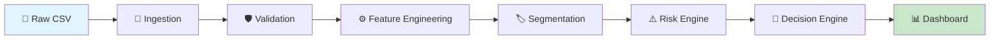

<div align="center">

# 🎯 Customer Lifecycle Intelligence Platform

### Transform Raw Transactions into Actionable Business Decisions

[](https://python.org)
[](https://streamlit.io)
[](https://plotly.com)
[](https://pandas.pydata.org)

<p align="center">
  <em>A production-ready analytics engineering system that converts transaction data into customer insights, risk assessments, and ROI-driven recommendations</em>
</p>

---

[Features](#-key-features) • [Architecture](#-system-architecture) • [Getting Started](#-getting-started) • [Documentation](#-documentation) • [Demo](#-live-demo)

</div>

---

## 📋 Overview

This repository contains an **end-to-end customer analytics and decision-support system** built using rule-based, deterministic logic designed for transparency and auditability.

<table>
<tr>
<td width="50%">

## 🎥 Live Demo

> 🔗 **[View Live Demo](https://customer-lifetime-intelligence.streamlit.app/)**
---

### 🎯 What This System Delivers

- **Customer-Level Features** – RFM metrics, trends, behavioral signals
- **Lifecycle Segmentation** – Rule-based classification
- **Risk Scores** – Weighted, normalized 0-100 scores
- **Business Actions** – Concrete recommendations per customer
- **ROI Estimates** – Cost-benefit analysis for each action
- **Plain-English Explanations** – Human-readable decision logic

</td>
<td width="50%">

### 💡 Why This Approach?

- ✅ **Fully Auditable** – Every decision is traceable
- ✅ **No Black Boxes** – Rule-based, not ML-based
- ✅ **Snapshot-Based** – Reproducible computations
- ✅ **Production-Ready** – Modular, testable architecture
- ✅ **Business-Focused** – Actions, not just analytics

</td>
</tr>
</table>

---

## ✨ Key Features

<div align="center">

| Feature | Description |
|---------|-------------|
| 🔄 **Data Ingestion** | Maps raw transactions to canonical schema with automatic validation |
| 🛡️ **Quality Gates** | Enforces strict data quality rules before processing |
| 📊 **Feature Engineering** | Computes RFM metrics, lifetime value, and behavioral trends |
| 🏷️ **Smart Segmentation** | Classifies customers by lifecycle stage and value tier |
| ⚠️ **Risk Engine** | Calculates weighted risk scores with transparent signals |
| 🎯 **Decision Engine** | Recommends actions with cost-benefit-ROI analysis |
| 📈 **Interactive Dashboard** | Streamlit + Plotly visualization with drill-downs |

</div>

---

## 🏗️ System Architecture



### Pipeline Stages

| Stage | Input | Output | Failure Behavior |
|-------|-------|--------|------------------|
| **Ingestion** | Raw CSV | Canonical records | Rejects malformed rows |
| **Validation** | Canonical data | Validated data | Fails fast on violations |
| **Features** | Validated data | Customer features | Computes or errors |
| **Segmentation** | Features | Segment labels | Rule-based assignment |
| **Risk Engine** | Features + Segments | Risk scores | Weighted aggregation |
| **Decision Engine** | All upstream | Actions + ROI | Deterministic rules |

---

## 📦 Module Breakdown

<details>
<summary><b>🔄 Ingestion Module</b></summary>

- Maps raw transaction data to a canonical schema
- Applies basic filtering (invalid prices, quantities, cancellations)
- Outputs standardized transaction records

</details>

<details>
<summary><b>🛡️ Validation Module</b></summary>

- Ensures required columns are present
- Enforces non-null and positivity constraints
- Prevents invalid data from entering downstream stages

</details>

<details>
<summary><b>⚙️ Feature Engineering</b></summary>

- **RFM Metrics** – Recency, Frequency, Monetary value
- **Lifetime Value** – Total customer worth calculation
- **Behavioral Trends** – Rolling time window analysis

</details>

<details>
<summary><b>🏷️ Segmentation Engine</b></summary>

- Lifecycle stages based on recency thresholds
- Value segments based on monetary percentiles
- 100% rule-based classification (no ML)

</details>

<details>
<summary><b>⚠️ Risk Engine</b></summary>

- Normalized risk signals (0–1 scale)
- Weighted aggregation into 0–100 risk scores
- Threshold-based risk level assignment (Low/Medium/High/Critical)

</details>

<details>
<summary><b>🎯 Decision Engine</b></summary>

- Action assignment using explicit business rules
- Cost and benefit estimation per customer
- ROI calculation with confidence levels
- Deterministic, text-based explanations

</details>

<details>
<summary><b>📊 Dashboard</b></summary>

- Built with **Streamlit** and **Plotly**
- Read-only presentation layer
- Filtering, drill-downs, and customer lookup
- Zero business logic in UI code

</details>

---

## 🚀 Getting Started

### Prerequisites

- Python 3.8+
- pip or conda

### Installation

```bash
# Clone the repository
git clone https://github.com/yourusername/customer-lifecycle-intelligence.git
cd customer-lifecycle-intelligence

# Create virtual environment
python -m venv venv
source venv/bin/activate   # Windows: venv\Scripts\activate

# Install dependencies
pip install -r requirements.txt
```

### Running the Application

```bash
python run.py
```

The dashboard will be available at: **http://localhost:8501**

### Data Format

Upload a CSV matching the Online Retail II schema:

```csv
Invoice, StockCode, Description, Quantity, InvoiceDate, Price, CustomerID, Country
```

---

## 🧪 Testing

Comprehensive unit tests validate:

- ✅ Feature computation accuracy
- ✅ Segmentation rule correctness
- ✅ Risk scoring logic
- ✅ Decision engine outputs

```bash
# Run all tests
pytest

# Run with coverage
pytest --cov=src
```

---

## 📁 Project Structure

```
customer-lifecycle-intelligence/
│
├── 📂 src/                    # Core business logic
│   ├── ingestion/             # Data loading & mapping
│   ├── validation/            # Quality gates
│   ├── features/              # Feature engineering
│   ├── segmentation/          # Customer classification
│   ├── risk_engine/           # Risk scoring
│   ├── decision_engine/       # Action recommendations
│   └── services/              # Shared utilities
│
├── 📂 dashboards/             # Streamlit pages
├── 📂 configs/                # YAML configurations
├── 📂 tests/                  # Unit & integration tests
├── 📂 docs/                   # Documentation
├── 📂 data/                   # Sample datasets
│
├── 📄 app.py                  # Streamlit entry point
├── 📄 run.py                  # Application runner
└── 📄 requirements.txt        # Dependencies
```

---

## 📚 Documentation

| Document | Description |
|----------|-------------|
| [📐 Architecture](docs/architecture.md) | System design & data flow |
| [📖 Data Dictionary](docs/data_dictionary.md) | Schema definitions |
| [⚖️ Decision Logic](docs/decision_logic.md) | Segmentation & action rules |
| [📋 Assumptions](docs/assumptions.md) | Business & analytical assumptions |

---

## 🛠️ Tech Stack

<div align="center">

| Category | Technologies |
|----------|--------------|
| **Language** | Python 3.8+ |
| **Data Processing** | Pandas, NumPy |
| **Visualization** | Plotly, Streamlit |
| **Testing** | Pytest |
| **Configuration** | YAML |

</div>

---

## 📌 Key Design Decisions

<table>
<tr>
<td>

### ❌ What This Is NOT
- No machine learning models
- No predictions or forecasting
- No black-box algorithms

</td>
<td>

### ✅ What This IS
- Deterministic logic
- Fully auditable rules
- Transparent decision-making

</td>
</tr>
</table>

---

## 🤝 Contributing

Contributions are welcome! Please feel free to submit a Pull Request.

1. Fork the repository
2. Create your feature branch (`git checkout -b feature/AmazingFeature`)
3. Commit your changes (`git commit -m 'Add AmazingFeature'`)
4. Push to the branch (`git push origin feature/AmazingFeature`)
5. Open a Pull Request

---

## 📄 License

This project is licensed under the MIT License - see the [LICENSE](LICENSE) file for details.

---

## ⭐ Show Your Support

If you found this project helpful, please give it a ⭐ on GitHub!

---

<div align="center">

**Built with ❤️ for Analytics Engineering**

</div>
